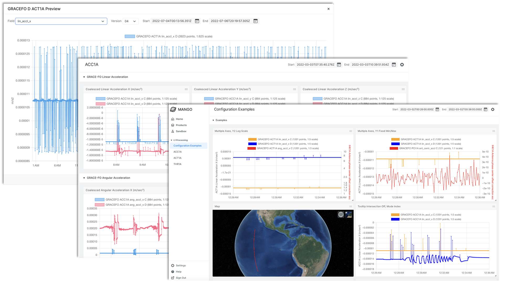

# MANGO UI

MANGO (Monitoring and ANalysis for Gravity Operations) is a downlink and telemetry monitoring tool for the GRACE missions. It enables users to quickly assess data quality and availability, compare data measurements across the GRACE missions, and export data for further analysis.

Highlighted features of MANGO:

- Dynamic and interactive plotting of data measurements
- Full-resolution plotting on sub-daily time ranges
- Performant plotting of data measurements for time ranges of weeks, months, and years
- Ability to compare data measurements across different orbits and GRACE missions

## Want to help?

If you are a developer, you can get started quickly by reading the [developer documentation][dev].

[dev]: ./docs/DEVELOPER.md
